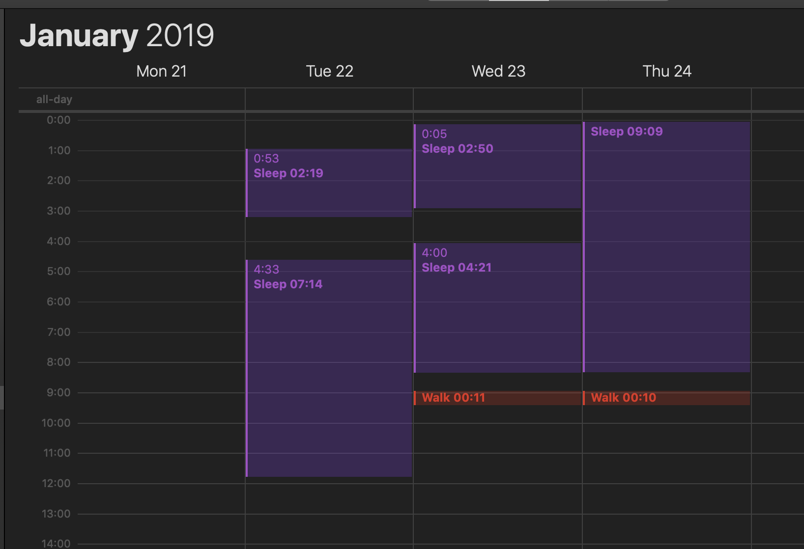
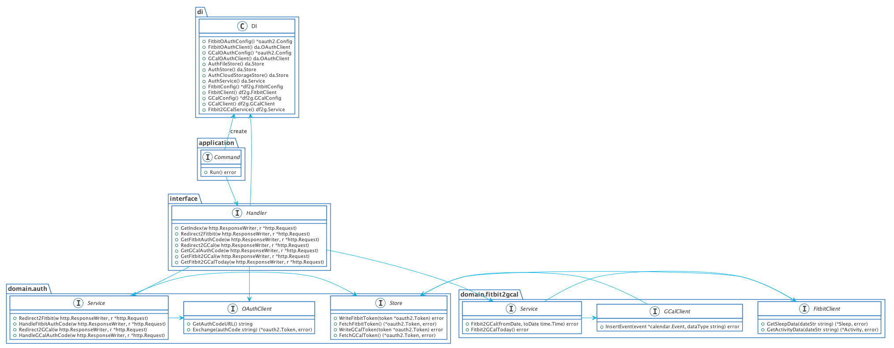

# GAE Fitbit Go

[](https://circleci.com/gh/go-zen-chu/gae-fitbit-go/tree/master)

GAE App for getting your own sleep & activity data from fitbit and post it to google calendar.



## How to deploy?

### Prerequisite

Install golang and gcloud command line.

Register your GAE endpoint in [Fitbit Applications](https://dev.fitbit.com/apps/new) and get client id, secret.

Also get client id, secret via [Calendar API  |  Google Developers](https://developers.google.com/calendar/).

### Deploy

```bash
cd ./app/gae-fitbit-go
cp app.yaml app.private.yaml

# write CLIENT ID, SECRET and CALENDAR ID to env_variables
vim app.private.yaml

gcloud app deploy app.private.yaml
```

Edit app.private.yaml like following.

````bash
env_variables:
  GAE_FITBIT_GO_FITBIT_CLIENT_ID: xxxx
  GAE_FITBIT_GO_FITBIT_CLIENT_SECRET: xxxxxxx
  GAE_FITBIT_GO_FITBIT_AUTH_REDIRECT_URI: https://xxxxxxxxx.appspot.com/v1/fitbitstoretoken
  GAE_FITBIT_GO_FITBIT_GCAL_SLEEP_CAL_ID: sssssssss@group.calendar.google.com
  GAE_FITBIT_GO_FITBIT_GCAL_ACTIVITY_CAL_ID: aaaaaaaaaa@group.calendar.google.com
  GAE_FITBIT_GO_GCAL_CLIENT_ID: xxxxxxxxx.apps.googleusercontent.com
  GAE_FITBIT_GO_GCAL_CLIENT_SECRET: xxxxxxxxxxxxx
  GAE_FITBIT_GO_GCAL_AUTH_REDIRECT_URI: https://xxxxxxxxx.appspot.com/v1/gcalstoretoken
  USE_CLOUD_STORAGE: true
  CLOUD_STORAGE_BUCKET_NAME: xxxxxxxxx
  GOOGLE_APPLICATION_CREDENTIALS: app/gae-fitbit-go/xxxxxxxx.json
````

### Set cron setting

[job scheduling with cron.yaml | Go |  Google Cloud](https://cloud.google.com/appengine/docs/flexible/go/scheduling-jobs-with-cron-yaml)

```
gcloud app deploy cron.yaml
```

## architecture


